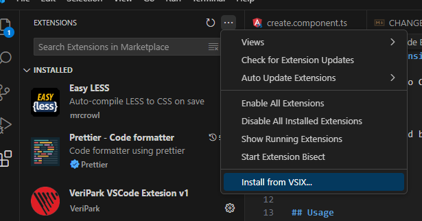
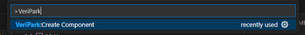

# VeriPark VSCode Extension v1

This is a Visual Studio Code extension developed for use within VeriPark

## Installation

Use .vsix file provided by VeriPark to install the extension

## Usage

Start Command Palette by Ctrl+Shift+P and then start typing 'VeriPark' to be able to see usable commands

